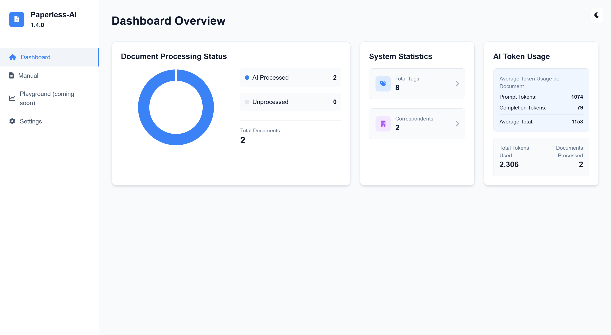
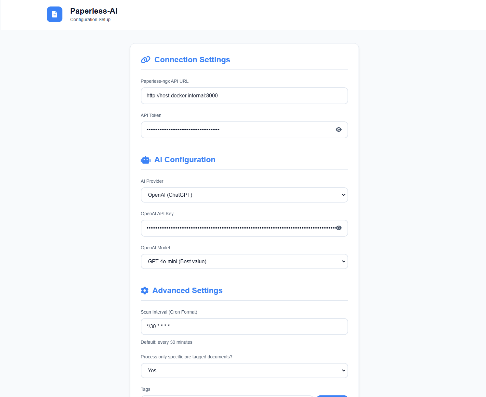

   


# Paperless-AI

An automated document analyzer for Paperless-ngx using OpenAI API and Ollama (Mistral, llama, phi 3, gemma 2) to automatically analyze and tag your documents. \
It features: Automode, Manual Mode, Ollama and OpenAI, a Chat function to query your documents with AI, a modern and intuitive Webinterface. 


### Disclaimer:
paperless-ai makes changes to the documents in your productive paperlessNGX instance that cannot be easily undone.
Do the configuration carefully and think twice. 
Please test the results beforehand in a separate development environment and be sure to back up your documents and metadata beforehand. 

## We have a chrome extension now to work right out of paperless-ngx itself for Document Chat!
Download here: https://github.com/clusterzx/paperless-ai/blob/main/paperless-ai-chrome-extension.zip

## We exploded! 💥
💚 Thank you for all your support, bug submit, feature requests 💚
<picture>
  <source
    media="(prefers-color-scheme: dark)"
    srcset="
      https://api.star-history.com/svg?repos=clusterzx/paperless-ai&type=Date&theme=dark
    "
  />
  <source
    media="(prefers-color-scheme: light)"
    srcset="
      https://api.star-history.com/svg?repos=clusterzx/paperless-ai&type=Date
    "
  />
  
</picture>

## IMPORTANT:
If you upgrade from 1.x to 2.1.x or later:
1. You are now forced to setup a user as the Webapp now requires authentication. I know many of you only use it in secured and encapsulated networks and don't care for authentication. But I think we all do good when we secure out data as much as possible.
2. You have to set the username the token key belongs to. There were so many bugs and issues that were traced back to Documents having other user/access rights then the api key could provide.
3. Thanks for listening, love ya!

## Features

### Automated Document Management
- **Automatic Scanning**: Identifies and processes new documents within Paperless-ngx.
- **AI-Powered Analysis**: Leverages OpenAI API and Ollama (Mistral, Llama, Phi 3, Gemma 2) for precise document analysis.
- **Metadata Assignment**: Automatically assigns titles, tags, and correspondent details.

### Advanced Customization Options
- **Predefined Processing Rules**: Specify which documents to process based on existing tags. *(Optional)* 🆕
- **Selective Tag Assignment**: Use only selected tags for processing. *(Disables the prompt dialog)* 🆕
- **Custom Tagging**: Assign a specific tag (of your choice) to AI-processed documents for easy identification. 🆕

### Manual Mode
- **AI-Assisted Analysis**: Manually analyze documents with AI support in a modern web interface. *(Accessible via the `/manual` endpoint)* 🆕

### Interactive Chat Functionality
- **Document Querying**: Ask questions about your documents and receive accurate, AI-generated answers. 🆕

### Intuitive Web Interface
- **Streamlined Configuration**: Easy-to-use setup interface available at `/setup`.
- **Dashboard Overview**: A clean and organized dashboard for monitoring and managing document processing.

### Reliability and Security
- **Error Handling**: Automatic restarts and health monitoring for improved stability.
- **Health Checks**: Ensures system integrity and alerts on potential issues.
- **Docker Integration**: Full Docker support, including health checks, resource management, and persistent data storage.

## Prerequisites

- Docker and Docker Compose
- Access to a Paperless-ngx installation
- OpenAI API key or your own Ollama instance with your chosen model running and reachable.
- Basic understanding of cron syntax (for scan interval configuration)

## Installation

Visit the Wiki for installation:\
[Click here for Installation](https://github.com/clusterzx/paperless-ai/wiki/Installation)
-------------------------------------------


## How it Works

1. **Document Discovery**
   - Periodically scans Paperless-ngx for new documents
   - Tracks processed documents in a local SQLite database

2. **AI Analysis**
   - Sends document content to OpenAI API or Ollama for analysis
   - Extracts relevant tags and correspondent information
   - Uses GPT-4o-mini or your custom Ollama model for accurate document understanding

3. **Automatic Organization**
   - Creates new tags if they don't exist
   - Creates new correspondents if they don't exist
   - Updates documents with analyzed information
   - Marks documents as processed to avoid duplicate analysis

## NEW! Manual Mode
You can now manually analyze your files by hand with the help of AI in a beautiful Webinterface.
Reachable via the ```/manual``` endpoint from the webinterface.

## NEW Dashboard:


## Configuration Options

The application can be configured through the Webinterface on the ```/setup``` Route.
You dont need/can't set the environment vars through docker.



## Docker Support

The application comes with full Docker support:

- Automatic container restart on failure
- Health monitoring
- Volume persistence for database
- Resource management
- Graceful shutdown handling

### Docker Commands

```bash
# Start the container
docker-compose up -d

# View logs
docker-compose logs -f

# Restart container
docker-compose restart

# Stop container
docker-compose down

# Rebuild and start
docker-compose up -d --build
```

## Health Checks

The application provides a health check endpoint at `/health` that returns:

```json
# Healthy system
{
  "status": "healthy"
}

# System not configured
{
  "status": "not_configured",
  "message": "Application setup not completed"
}

# Database error
{
  "status": "database_error",
  "message": "Database check failed"
}
```

## Debug Interface

The application includes a debug interface accessible via `/debug` that helps administrators monitor and troubleshoot the system's data:

- 🔍 View all system tags
- 📄 Inspect processed documents
- 👥 Review correspondent information

### Accessing the Debug Interface

1. Navigate to:
```
http://your-instance:3000/debug
```

2. The interface provides:
   - Interactive dropdown to select data category
   - Tree view visualization of JSON responses
   - Color-coded data representation
   - Collapsible/expandable data nodes

### Available Debug Endpoints

| Endpoint | Description |
|----------|-------------|
| /debug/tags | Lists all tags in the system |
| /debug/documents | Shows processed document information |
| /debug/correspondents | Displays correspondent data |

### Health Check Integration

The debug interface also integrates with the health check system, showing a configuration warning if the system is not properly set up.

## Development

To run the application locally without Docker:

1. Install dependencies:
```bash
npm install
```

2. Start the development server:
```bash
npm run test
```

## Contributing

1. Fork the repository
2. Create your feature branch (`git checkout -b feature/AmazingFeature`)
3. Commit your changes (`git commit -m 'Add some AmazingFeature'`)
4. Push to the branch (`git push origin feature/AmazingFeature`)
5. Open a Pull Request

## Security Considerations

- Store API keys securely
- Restrict container access
- Monitor API usage
- Regularly update dependencies
- Back up your database

## License

This project is licensed under the MIT License - see the [LICENSE](LICENSE) file for details.

## Acknowledgments

- [Paperless-ngx](https://github.com/paperless-ngx/paperless-ngx) for the amazing document management system
- OpenAI API
- The Express.js and Node.js communities for their excellent tools

## Support

If you encounter any issues or have questions:

1. Check the [Issues](https://github.com/clusterzx/paperless-ai/issues) section
2. Create a new issue if yours isn't already listed
3. Provide detailed information about your setup and the problem

## Roadmap

- [x] Support for custom AI models
- [x] Support for multiple language analysis
- [x] Advanced tag matching algorithms
- [ ] Custom rules for document processing
- [ ] Enhanced web interface with statistics

